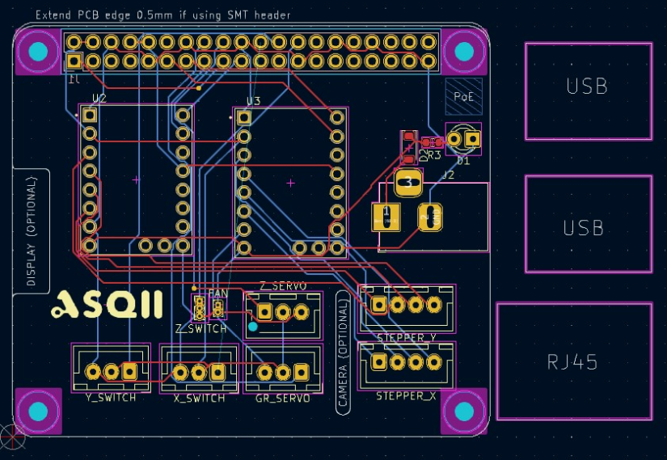
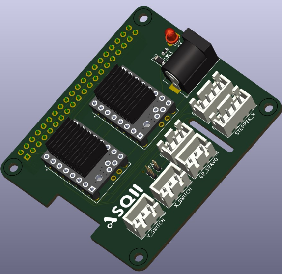
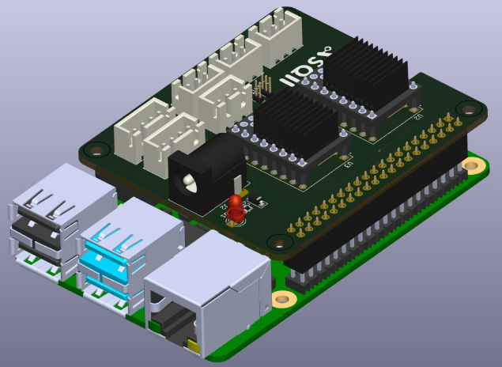

# 🧠 Custom Raspberry Pi Hat for Stepper and Servo Control

This project is a custom PCB designed to **replace the Arduino + CNC Shield v4 setup** with a **more compact and integrated solution**, tailored to the specific needs of our automated machine.

## 🚀 Why This PCB?

This board was developed in collaboration with [Company Name] to optimize space, improve performance, and simplify wiring when interfacing with the Raspberry Pi 4.

### 🧩 Key Features

- 🔄 **2x TMC2209 Stepper Drivers**  
  Ultra-silent and precise stepper control with UART configuration.

- ⚙️ **2x Servo Motor Connectors**  
  Designed to control the gripper's movement directly.

- 🧱 **3x Endstop Inputs**  
  Ensures reliable homing and positional accuracy.

- 🌬️ **Fan Connector (5V)**  
  Keeps your electronics cool during operation.

- 🔌 **GPIO-Optimized for Raspberry Pi 4**  
  Carefully routed for clean integration and minimal cabling.

## 📐 PCB Overview

### 🖼️ Top View

### 🗺️ Schematic Diagram

### 🏗️ 3D Render

